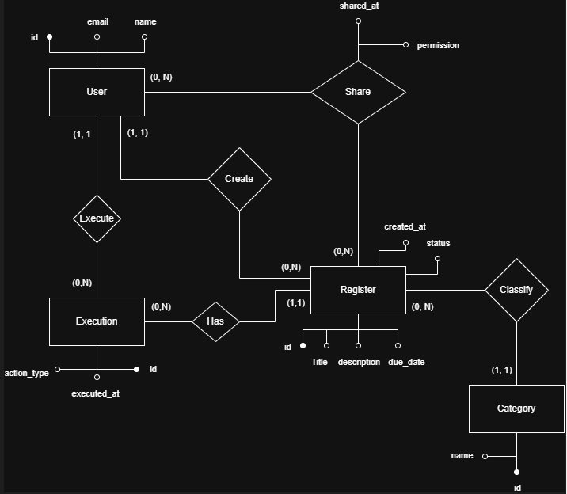

O domínio escolhido para o trabalho é uma ferramenta de gerenciamento de tarefas colaborativo, a onde, um usuário é capaz de criar registros que podem ser tanto uma anotação mental, uma tarefa, uma ideia, uma receita, qualquer tipo de nota. 

Esses registros possuem campos como, titulo, descrição, um possível prazo e qual a sua categoria. 

As categorias são escolhidas pelo usuário e possuem um campo de nome. 

O usuário escolhe se ele quer ou não compartilhar esse registro com algum outro usuário, compartilhando assim o mesmo registro com ambos. 

Um registro pode ser também executado, para trocar seu status de pendente para executado(concluído) ou de executado para pendente novamente, essas execuções ficam salvas, onde é possível visualizar todas as execuções do usuário.

Também é possível criar usuários, criar registros, criar categorias, criar compartilhamentos bem como realizar ações de atualizar e deletar em cada entidade.

É possível listar todas os registros que o usuário compartilhou com outros usuários, bem como, ver os registros que foram compartilhados com ele.


## 2. Esquema Conceitual 
---



users (#id, name, email, created_at)

categories (#id, name)

registers (#id, title, description, created_at, due_date, status, &creator_id, &category_id)

sharing (#&user_id, #&register_id, permission, shared_at)

executions (#id, action_type, executed_at, &user_id, &register_id)
## 3. Esquema Lógico (Dicionário de Dados)
---
# Relação Users

| Atributo  | Domínio  | Tamanho | RI                          | Descrição                      |
|-----------|-----------|----------|-----------------------------|--------------------------------|
| id        | Numérico  | —        | Chave primária              | Identificador do usuário       |
| name      | Texto     | 255      | —                           | Nome do usuário                |
| email     | Texto     | 255      | Índice único                | Email do usuário               |
| created_at| Data/Hora | —        | —                           | Data de criação do usuário     |

---

# Relação Categories

| Atributo | Domínio | Tamanho | RI               | Descrição                     |
|----------|----------|----------|------------------|-------------------------------|
| id       | Numérico | —        | Chave primária   | Identificador da categoria    |
| name     | Texto    | 255      | —                | Nome da categoria             |

---

# Relação Registers

| Atributo   | Domínio   | Tamanho | RI                                              | Descrição                                      |
|------------|------------|----------|-------------------------------------------------|------------------------------------------------|
| id         | Numérico   | —        | Chave primária                                  | Identificador do registro                      |
| title      | Texto      | 255      | —                                               | Título do registro                             |
| description| Texto      | —        | —                                               | Descrição do registro                          |
| created_at | Data/Hora  | —        | —                                               | Data de criação do registro                    |
| due_date   | Data       | —        | —                                               | Prazo do registro                              |
| status     | Texto      | 50       | —                                               | Estado do registro                             |
| creator_id | Numérico   | —        | Chave estrangeira para relação Users            | Usuário criador do registro                    |
| category_id| Numérico   | —        | Chave estrangeira para relação Categories       | Categoria associada ao registro                |

---

# Relação Sharing

| Atributo   | Domínio   | Tamanho | RI                                              | Descrição                                      |
|------------|------------|----------|-------------------------------------------------|------------------------------------------------|
| user_id    | Numérico   | —        | Chave estrangeira para relação Users            | Usuário que recebeu o compartilhamento         |
| register_id| Numérico   | —        | Chave estrangeira para relação Registers        | Registro compartilhado                         |
| permission | Texto      | 10       | —                                               | Permissão do compartilhamento                  |
| shared_at  | Data/Hora  | —        | —                                               | Data do compartilhamento                       |

---

# Relação Executions

| Atributo    | Domínio   | Tamanho | RI                                              | Descrição                                      |
|-------------|------------|----------|-------------------------------------------------|------------------------------------------------|
| id          | Numérico   | —        | Chave primária                                  | Identificador da execução                      |
| user_id     | Numérico   | —        | Chave estrangeira para relação Users            | Usuário que executou a ação                    |
| register_id | Numérico   | —        | Chave estrangeira para relação Registers        | Registro executado                             |
| action_type | Texto      | 50       | —                                               | Tipo de ação realizada                         |
| executed_at | Data/Hora  | —        | —                                               | Data da execução                               |


## 4. Instruções para Execução do Sistema
---
## Instruções para Execução do Sistema

Antes de executar o projeto, é necessário ter instalado no computador Node.js versão 18 ou superior, npm, PostgreSQL e Git.

Para baixar e preparar o projeto em um computador novo, execute os comandos abaixo no terminal:

```bash
git clone https://github.com/JvSchulz/Gerenciador-de-Tarefas-Colaborativo.git
cd NOME_DA_PASTA_DO_PROJETO
npm install
```

Um backup do banco está disponibilizado no diretório raiz do projeto, está no formato plain text.

Após importar o banco, atualize o arquivo `.env` na raiz do projeto com as configurações de conexão com o PostgreSQL:

```env
DB_HOST=localhost
DB_PORT=5432
DB_USER=seu_usuario
DB_PASSWORD=sua_senha
DB_NAME=nome_do_banco
```

Exemplo:

```env
DB_HOST=localhost
DB_PORT=5432
DB_USER=postgres
DB_PASSWORD=123456
DB_NAME=registros_colaborativos
```

Com as dependências instaladas, o banco importado e o arquivo `.env` configurado, execute o sistema em modo texto:

```bash
node cli.js
```

Ou, caso exista um script configurado no `package.json`, execute:

```bash
npm start
```

Após iniciar, o sistema exibirá um menu no terminal com opções como Usuários, Categorias, Registros, Compartilhamento, Execução, Relatórios e Sair. Utilize as setas do teclado para navegar entre as opções e pressione Enter para selecionar.